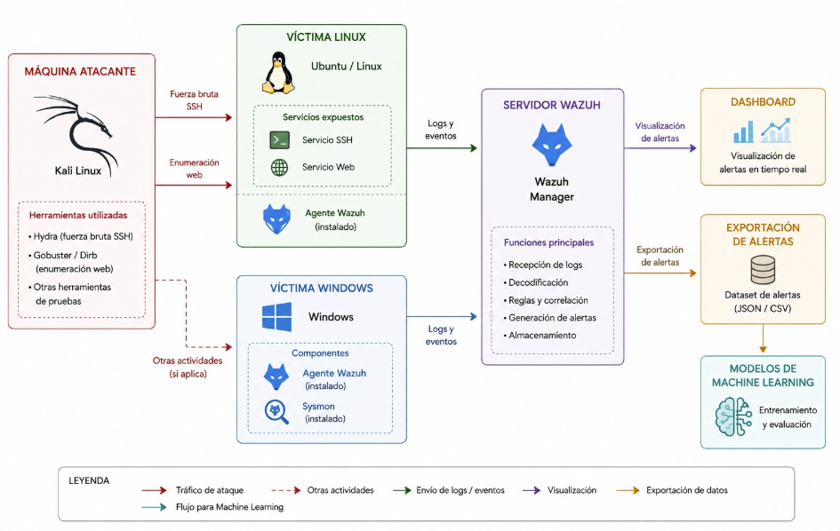
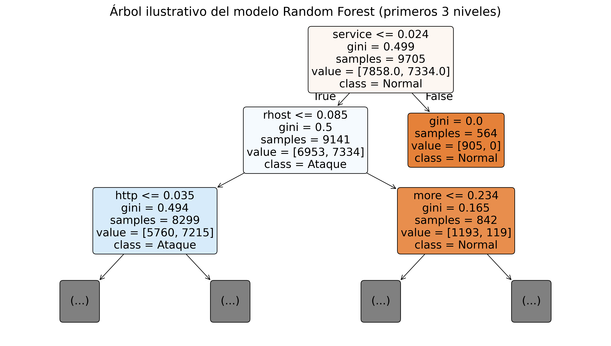
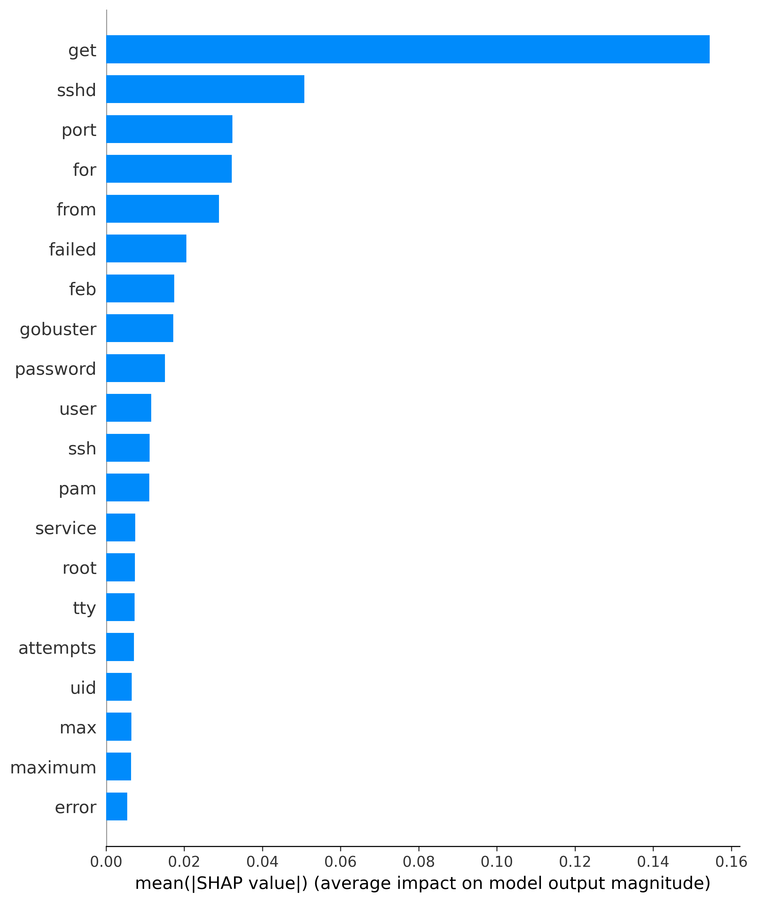

# 🛡️ Wazuh + Machine Learning para detección de ciberataques

<p align="center">
  <strong>Integración de técnicas de Machine Learning con Wazuh para mejorar la detección de anomalías o ciberataques</strong>
</p>

<p align="center">
  Wazuh · Cybersecurity · Machine Learning · Random Forest · SHAP · Python
</p>

---

## 🚀 Sobre el proyecto

Este repositorio contiene el desarrollo realizado para mi **Trabajo Fin de Grado**, centrado en estudiar cómo técnicas de **Machine Learning** pueden complementar la detección basada en reglas de **Wazuh**.

El proyecto parte de eventos reales generados dentro de un laboratorio controlado de ciberseguridad y construye un flujo completo desde la recogida de datos hasta su análisis mediante modelos de Machine Learning.

La idea general es:

```text
Actividad del laboratorio
        │
        ▼
      Wazuh
        │
        ├── Eventos completos
        │       │
        │       ▼
        │   Etiquetado
        │       │
        │       ▼
        │    Dataset
        │       │
        │       ▼
        │ Machine Learning
        │       │
        │       ├── Regresión Logística
        │       └── Random Forest
        │
        └── Alertas de Wazuh
                │
                ▼
       Comparación Wazuh vs ML
                │
        ┌───────┴────────┐
        ▼                ▼
       SHAP        Humanización
        │
        ▼
Reglas candidatas
     de Wazuh
```

---

## 💡 ¿Qué tiene de interesante?

No se trata únicamente de entrenar un modelo sobre un CSV.

El proyecto incluye todo el proceso:

- 🧪 creación de un laboratorio de ciberseguridad;
- 🛡️ recogida de eventos mediante Wazuh;
- 🏷️ etiquetado de actividad normal y ataques;
- 📦 construcción de un dataset propio;
- 🤖 entrenamiento de Regresión Logística y Random Forest;
- ⚖️ comparación directa entre Random Forest y las alertas de Wazuh;
- 🧠 interpretación del modelo mediante SHAP;
- 👨‍💻 transformación de detecciones en incidentes más legibles;
- 🧩 generación experimental de reglas candidatas de Wazuh a partir de patrones descubiertos por el modelo.

---

## 🧪 Laboratorio

Las pruebas se realizaron en un entorno propio y controlado utilizando diferentes sistemas y herramientas.

<p align="center">
  
</p>

Entre las tecnologías utilizadas se encuentran:

`Wazuh` · `Linux` · `Apache` · `SSH` · `Kali Linux` · `Hydra` · `DIRB` · `Gobuster` · `Nmap` · `Python`

---

## 🤖 Machine Learning

Los eventos se representan mediante información textual procedente de Wazuh y se transforman utilizando **TF-IDF**.

Los modelos principales estudiados son:

### Regresión Logística

Utilizada como modelo lineal de referencia y para estudiar la influencia de los términos sobre la clasificación.

### Random Forest

Modelo principal seleccionado durante la evaluación experimental.

El análisis posterior permite estudiar tanto sus predicciones como la estructura de los árboles que forman el bosque.

<p align="center">
  
</p>

---

## 🧠 Interpretabilidad con SHAP

Además de evaluar el rendimiento del modelo, se utiliza **SHAP** para estudiar qué términos influyen en las decisiones de Random Forest.

<p align="center">
  
</p>

Esto permite pasar de:

> “el modelo detecta ataques”

a intentar responder:

> “¿qué patrones está utilizando para detectarlos?”

---

## 🆚 Wazuh vs Machine Learning

Las predicciones del modelo se comparan con las alertas generadas por Wazuh sobre los mismos escenarios experimentales.

La comparación permite estudiar:

- eventos detectados por ambos;
- eventos detectados únicamente por Random Forest;
- eventos detectados únicamente por Wazuh;
- falsos positivos y falsos negativos.

Los resultados completos pueden consultarse en:

```text
Resultados/comparacion_wazuh_ml/
```

y en:

```text
Resultados/matrices_confusion/
```

---

## 🧑‍💻 Humanización de detecciones

Las predicciones individuales de Random Forest pueden agruparse temporalmente para producir salidas más fáciles de interpretar.

```text
Predicciones del modelo
        │
        ▼
Selección de ataques
        │
        ▼
Agrupación temporal
        │
        ▼
Incidentes legibles
```

El objetivo es acercar la salida del modelo a un formato que pueda resultar más útil para un analista de seguridad.

---

## 🧩 SHAP → reglas de Wazuh

Como prueba de concepto, el proyecto también explora una idea adicional:

```text
Random Forest
     ↓
    SHAP
     ↓
Patrones relevantes
     ↓
Ruleset de Wazuh
     ↓
Reglas candidatas
```

El objetivo no es generar automáticamente reglas listas para producción, sino estudiar si algunos patrones descubiertos mediante Machine Learning pueden servir como apoyo para mejorar o crear mecanismos de detección basados en reglas.

---

## 📁 Estructura

```text
TFG-Wazuh-ML/
│
├── Codigo/
│   ├── 01_etiquetado/
│   ├── 02_construccion_dataset/
│   ├── 03_entrenamiento/
│   ├── 04_comparacion_wazuh_ml/
│   ├── 05_interpretabilidad_shap/
│   ├── 06_humanizacion/
│   └── 07_reglas_shap/
│
├── Dataset/
│   ├── raw/
│   ├── labeled/
│   ├── wazuh_alerts_reference/
│   └── final/
│
├── Resultados/
├── Reglas_Wazuh/
├── Figuras/
└── Memoria/
```

### `Codigo/`

Scripts utilizados durante las diferentes fases del proyecto.

### `Dataset/`

Datos originales, archivos etiquetados, alertas de referencia y dataset final.

### `Resultados/`

Métricas, matrices de confusión, análisis de modelos, SHAP, comparación con Wazuh y resultados de humanización.

### `Reglas_Wazuh/`

Ruleset utilizado como referencia y reglas candidatas generadas durante la prueba de concepto.

### `Memoria/`

Memoria completa del Trabajo Fin de Grado.

---

## 🛠️ Tecnologías

### Ciberseguridad

- Wazuh
- Kali Linux
- Linux
- Apache
- SSH
- Hydra
- DIRB
- Gobuster
- Nmap

### Machine Learning y análisis

- Python
- pandas
- NumPy
- scikit-learn
- Matplotlib
- SHAP
- TF-IDF
- Logistic Regression
- Random Forest

---

## ⚙️ Dependencias

```bash
pip install -r requirements.txt
```

---

## ⚠️ Nota sobre los scripts

Los scripts se conservan tal y como fueron utilizados durante el desarrollo experimental del TFG.

Posteriormente, los archivos se reorganizaron dentro del repositorio para facilitar su consulta.

Por este motivo, algunos scripts pueden requerir ejecutarse desde su directorio de trabajo correspondiente o adaptar alguna ruta local.

Se ha preferido conservar la lógica original utilizada para obtener los resultados del proyecto.

---

## 🔐 Uso responsable

Todas las pruebas ofensivas se realizaron exclusivamente dentro de un **laboratorio propio y controlado con fines académicos**.

Las técnicas y herramientas incluidas en este repositorio deben utilizarse únicamente sobre sistemas para los que se disponga de autorización.

---

## 👨‍💻 Autor

**Pablo Sánchez-Palencia Gómez**

Trabajo Fin de Grado

**Director:** Antonio Mora García  
**Codirector:** Juan Francisco Valenzuela Valdés

---

<p align="center">
  <strong>🛡️ Ciberseguridad defensiva aplicada con Inteligencia Artificial</strong>
</p>